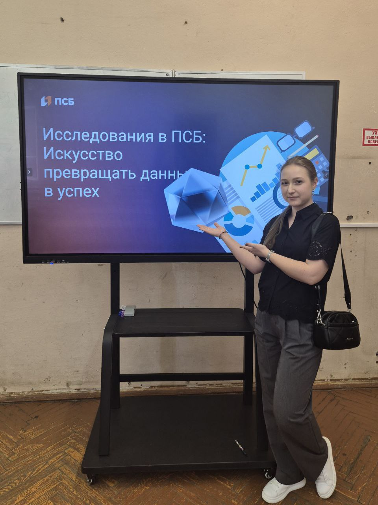
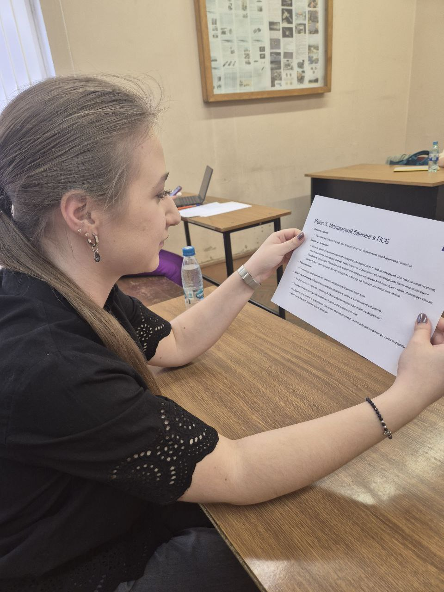
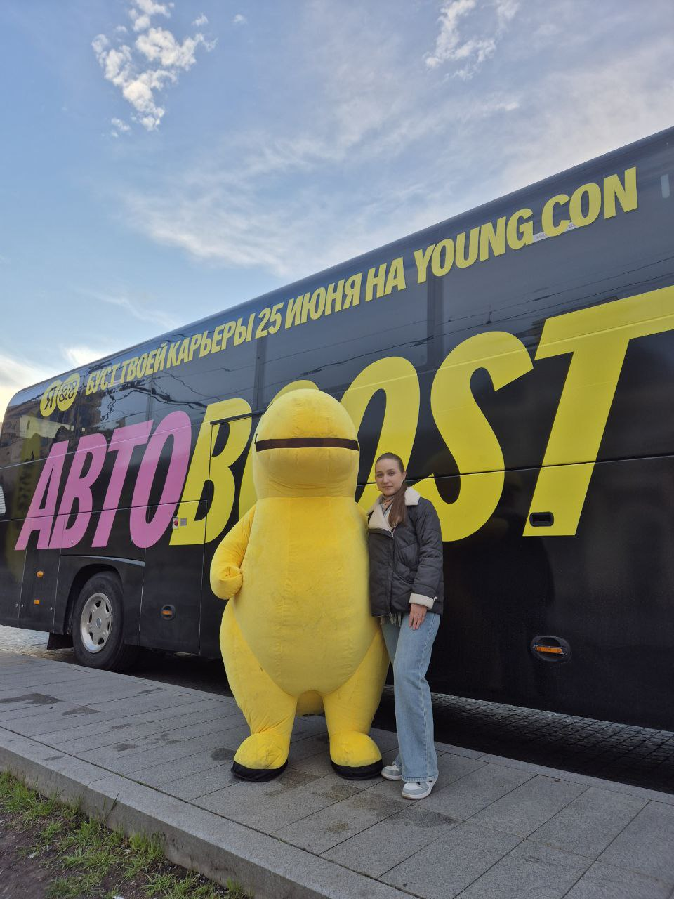
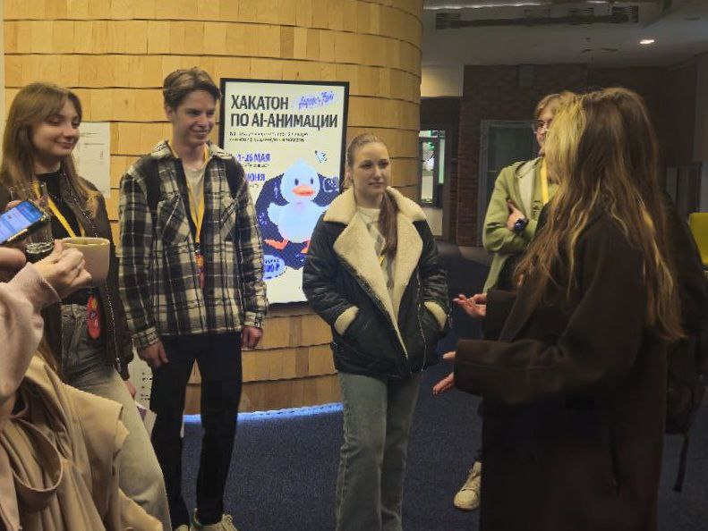

# ОТЧЁТ по взаимодействию с организацией-партнёром  

**Студент**: Андрианова Мария Ивановна, **Группа**: 241-361  

1. В рамках карьерного марафона от Московского Политеха 24 апреля принято участие в мастер-классе «Исследования с СПБ. Искусство превращать данные в успех». (приложения 1-2)  

**Полученный опыт и приобретённые знания**  
- **Работа с целевой аудиторией**:  
  Освоены методы сегментации аудитории, выявления потребностей и барьеров через инструменты качественных (интервью, фокус-группы) и количественных (опросы, анализ транзакций) исследований. На примере кейса «Исламский банкинг в ПСБ» отработаны подходы к изучению нишевых групп, включая учёт культурных и этических особенностей.  
- **Методология исследований**:  
  Получены знания о принципах построения гипотез, валидации данных и их интеграции в процесс разработки продукта, также о методах сбора обратной связи от пользователей.  
- **Проектирование решений**:  
  Участие в разработке рекомендаций по адаптации банковских продуктов под запросы аудитории позволило понять, как трансформировать исследовательские данные в конкретные бизнес-действия.  

**Связь с проектом**  
Опыт, полученный на мастер-классе, напрямую способствует реализации проекта «Собственный бизнес в партнёрстве с «Texel. Аватары для метавселенных, VR и игр»:  
- **Исследование аудитории**:  
  Методы, освоенные в кейсе «Исламский банкинг», могут быть применены для изучения потребностей пользователей VR-платформ. Например:  
  - Проведение опросов среди геймеров и участников метавселенных для выявления ключевых требований к аватарам (реалистичность, кастомизация, совместимость с движками).  
  - Анализ культурных особенностей аудитории для предложения персонализированных решений (например, аватары в традиционной одежде).  
- **Оптимизация продукта**:  
  - Использование количественных данных для оценки удовлетворённости пользователей прототипом сервиса.  
  - Адаптация интерфейса на основе обратной связи, собранной через фокус-группы или A/B-тесты.  

---

2. В рамках фестиваля YOUNG CON 2025 ([https://yandex.ru/youngcon/autoboost](https://yandex.ru/youngcon/autoboost)) 13 мая прослушана лекция на тему "Как дедлайны меняют маршруты" и посещена экскурсия в главный офис Яндекс. (приложения 3-4)  

**Полученный опыт и приобретённые знания**  
**Из лекции**:  
- Научилась разбивать большие задачи на этапы и распределять время так, чтобы укладываться в сроки.  
- Узнала о методах гибкого планирования (например, «правило 80/20») и способах быстрой перестройки планов при форс-мажорах.  

**Экскурсия в офис Яндекс**:  
- Увидела, как организовано рабочее пространство в IT-компании — зоны для командной работы, переговорки, места для отдыха.  
- Поняла, как дизайн офиса и атмосфера влияют на продуктивность и креативность сотрудников.  

**Связь с проектом**  
Опыт, полученный на лекции и экскурсии, напрямую способствует реализации проекта «Собственный бизнес в партнёрстве с «Texel. Аватары для метавселенных, VR и игр»:  
**Лекция**:  
- Поможет соблюдать дедлайны на каждом этапе проекта. Например, если нужно за месяц сделать прототип, смогу разбить работу на недельные цели: исследование → дизайн → тестирование.  
- Научусь переключаться между задачами, если что-то пойдёт не так (например, если нейросеть долго обучается, параллельно займусь сбором обратной связи от пользователей).  

**Экскурсия**:  
- Увидела, что даже в большом офисе важны мелочи: яркий дизайн, удобная мебель, места для общения. Это вдохновило продумать наше рабочее пространство так, чтобы всем было комфортно.  
- Заметила, как в Яндексе используют цвета и стиль в оформлении — можно добавить что-то подобное в дизайн нашего сервиса, чтобы он выглядел современно.  

---

**Студент**: Ахметдинова Диана Румильевна, **Группа**: 241-361  
**Студент**: Иноземцева Арина Дмитриевна, **Группа**: 241-361  

В рамках реализации проекта наша команда выражает заинтересованность в активном взаимодействии с мероприятиями партнёрской организации Texel. Однако в связи с высокой учебной нагрузкой участников и несовпадением академического расписания с графиком мероприятий физическое присутствие всей команды на событиях оказалось ограниченным.  

Участник проекта Андрианова Мария Ивановна, посетивший ключевые мероприятия, оперативно транслировал полученные материалы, ключевые тезисы и личные наблюдения в общие рабочие чаты команды. Это позволило сохранить вовлечённость всех членов группы в процесс.  

---

## ЗАКЛЮЧЕНИЕ  

Участие в мероприятиях карьерного марафона и фестиваля YOUNG CON 2025 позволило приобрести ценный опыт, актуальный для реализации проекта «Собственный бизнес в партнёрстве с «Texel. Аватары для метавселенных, VR и игр». На мастер-классе «Исследования с СПБ» освоены методы работы с целевой аудиторией, включая анализ культурных особенностей и валидацию данных, что критично для изучения потребностей пользователей VR-платформ. Лекция «Как дедлайны меняют маршруты» дала инструменты для эффективного планирования и гибкого управления задачами, а экскурсия в офис Яндекс вдохновила на создание комфортной рабочей среды и современного дизайна интерфейса.  

Несмотря на ограниченное физическое присутствие команды на мероприятиях Texel из-за учебной нагрузки, активное участие Андриановой М.И. и её оперативная трансляция материалов в общие чаты обеспечили вовлечённость всех участников. Полученные знания уже применяются в проекте: от сегментации аудитории до оптимизации процессов разработки. Это укрепляет уверенность в успешной реализации сервиса для создания аватаров, отвечающего запросам рынка метавселенных.  

---

## ПРИЛОЖЕНИЯ

