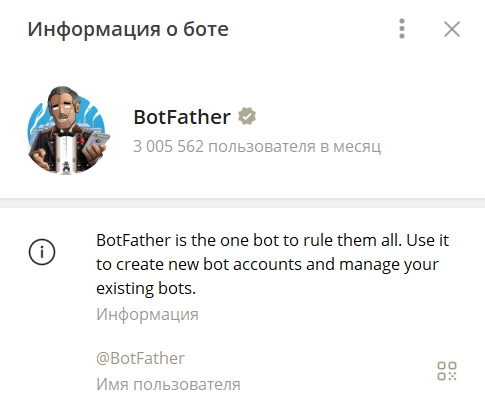
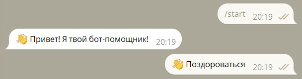
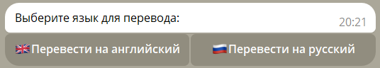
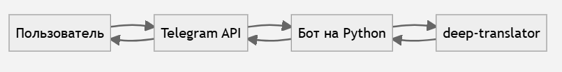
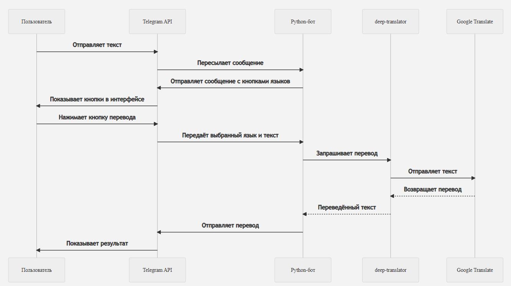
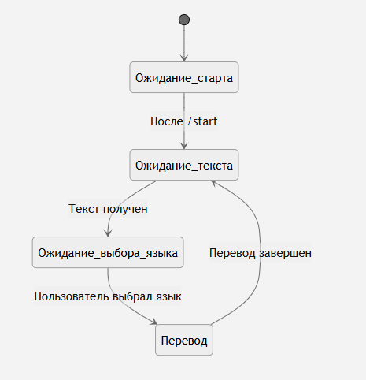

# Исследование и разработка Telegram-бота-переводчика.pdf

# Создание Telegram-бота для перевода текста на Python

## 1. Исследование предметной области

### 1.1 Актуальность

Telegram давно перестал быть просто мессенджером. Сегодня это многофункциональная платформа, которую миллионы пользователей по всему миру используют не только для общения, но и для решения различных повседневных задач:

- Ведение личных заметок и хранения идей;
- Использование каналов и групп для получения новостей, обучающих материалов и работы;
- Общение с нейросетями и AI-помощниками, включая интеграции с ChatGPT;
- Хранение файлов и документов, фактически превращая Telegram в облачное хранилище;
- Переписка с собеседниками на разных языках — как в личных, так и в рабочих чатах.  

На фоне всего этого потребность в быстрой, встроенной функции перевода становится особенно очевидной. Пользователям неудобно копировать текст в отдельные приложения или браузеры, чтобы перевести его, — гораздо эффективнее получить перевод прямо внутри Telegram.  

Таким образом, реализация Telegram-бота-переводчика:

- Повышает удобство работы с многоязычным контентом;
- Ускоряет процесс взаимодействия с иностранной информацией;
- Делает Telegram ещё более универсальным инструментом в повседневной жизни.

### 1.2 Постановка цели

Целью нашей работы является создание Telegram-бота на Python для перевода текста на различные языки. 

### 1.3 Определение функционала бота

Функционал бота должен включать в себя удобное меню с кнопками выбора языка, что будет делать процесс перевода быстрым и интуитивно понятным.  

Основные функции бота:

- /start — приветствие.
- Отображение кнопки с приветствием и ее обработка.
- Обработка пользовательского текста.
- Обработка нажатий кнопок с выбором языка для перевода.
- Перевод текста.
- Вывод пользователю.

### 1.4 Изучение необходимых библиотек

#### Список технологий для изучения:

- Документация Python: https://docs.python.org/3/
- Telegram Bot API: https://core.telegram.org/bots/api
- Документация deep-translator (библиотека Python для использования онлайн-переводчиков, включая Google Translate): https://deep-translator.readthedocs.io/en/latest/
- Telegram-бот (служебный бот для создания и управления Telegram-ботами.): @BotFather
- Основа для изучения технологии создания Telegram-бота: https://www.freecodecamp.org/news/how-to-create-a-telegram-bot-using-python/
- Основа для создания кнопок Telegram-бота: https://habr.com/ru/articles/697052/

### 1.5 Постановка задач

Мы поставили перед собой следующие задачи:

- Изучить Telegram Bot API и библиотеки pyTelegramBotAPI и deep-translator для реализации перевода текста.
- Реализовать обработку команды /start и кнопки приветствия.
- Создать интерфейс с интерактивными кнопками для выбора языка перевода.
- Реализовать перевод текста на разные языки.
- Обработать действия пользователя при выборе языка и отобразить результат перевода.

## 2. Техническое руководство по созданию Telegram-бота-переводчика, ориентированное на начинающих.

### 2.1 Установите Python

1. Перейдите на официальный сайт Python: [https://www.python.org/](https://www.python.org/)
2. Скачайте и установите последнюю версию.
3. Проверьте установку в командной строке:
   ```bash
   python --version
   ```

### 2.2 Настройте среду разработки

1. Создайте папку для проекта, например, `translate_bot`.
2. Откройте командную строку в этой папке и создайте виртуальное окружение:
   ```bash
   python -m venv venv
   ```
3. Активируйте виртуальное окружение:

   **Для Windows:**
   ```bash
   venv\Scripts\activate
   ```

   **Для macOS/Linux:**
   ```bash
   source venv/bin/activate
   ```

### 2.3 Установите необходимые библиотеки

В активированном окружении введите:

```bash
pip install pyTelegramBotAPI deep-translator
```

- `pyTelegramBotAPI` — библиотека для работы с Telegram API.
- `deep-translator` — библиотека для перевода текста.

### 2.4 Создайте бота в Telegram

1. Откройте Telegram и найдите `@BotFather`.
2. Нажмите `/start`, затем отправьте команду `/newbot`.
3. Следуйте инструкциям:
   - Введите имя бота (например, `MyTranslatorBot`).
   - Введите username (должен оканчиваться на `bot`, например, `MyTranslatorBot_bot`).
4. Скопируйте выданный API токен — он будет нужен в коде.  



### 2.5 Напишите код бота

#### 1) Импорт библиотек

```python
import telebot
from telebot import types
from telebot.types import InlineKeyboardMarkup, InlineKeyboardButton
from deep_translator import GoogleTranslator
```

- `telebot` — библиотека для работы с Telegram API.
- `types` — для создания кнопок и интерфейсов.
- `InlineKeyboardMarkup` и `InlineKeyboardButton` — для создания интерактивных кнопок.
- `GoogleTranslator` — перевод текста через Google Translate.


#### 2) Инициализация бота

```python
BOT_TOKEN = 'ВАШ_ТОКЕН_СЮДА'
bot = telebot.TeleBot(BOT_TOKEN)
```

- `BOT_TOKEN` — ключ, выданный @BotFather.
- `telebot.TeleBot()` — создаёт экземпляр бота.


#### 3) Обработчик команды /start

```python
@bot.message_handler(commands=['start'])
def start_command(message):
    markup = types.ReplyKeyboardMarkup(resize_keyboard=True)
    btn1 = types.KeyboardButton("👋 Поздороваться")
    markup.add(btn1)
    bot.send_message(message.chat.id, "👋 Привет! Я твой бот-помощник!", reply_markup=markup)
```



- `@bot.message_handler(commands=['start'])` — функция срабатывает при вводе команды `/start`.
- `ReplyKeyboardMarkup` — отображает клавиатуру с кнопкой.
- `resize_keyboard=True` — подгоняет размер кнопок под экран.
- `KeyboardButton` — кнопка с текстом.
- `send_message()` — отправляет сообщение пользователю.


#### 4) Обработчик текстовых сообщений

```python
@bot.message_handler(content_types=['text'])
def handle_text(message):
    if message.text == '👋 Поздороваться':
        remove_markup = types.ReplyKeyboardRemove()
        bot.send_message(message.chat.id, "Введите предложение", reply_markup=remove_markup)
    else:
        markup = InlineKeyboardMarkup(row_width=2)
        markup.add(
            InlineKeyboardButton("🇬🇧 Перевести на английский", callback_data=f'en|{message.text}'),
            InlineKeyboardButton("🇷🇺 Перевести на русский", callback_data=f'ru|{message.text}')

        )
        bot.send_message(message.chat.id, "Выберите язык для перевода:", reply_markup=markup)
```


- `content_types=['text']` — функция реагирует на текстовые сообщения.
- `ReplyKeyboardRemove()` — скрывает клавиатуру после нажатия.
- `InlineKeyboardMarkup` — создаёт кнопки под сообщением.
- `row_width=2` — количество кнопок в строке.
- `InlineKeyboardButton` — создаёт кнопку с текстом и данными.
- `callback_data=f'язык|текст'` — данные, передающиеся при нажатии кнопки.


#### 5) Обработчик нажатий на кнопки

```python
@bot.callback_query_handler(func=lambda call: True)
def callback_query(call):
    target_language, original_text = call.data.split('|')
    translated = GoogleTranslator(source='auto', target=target_language).translate(original_text)
    bot.send_message(call.message.chat.id, f"Перевод: {translated}")
```

- `callback_query_handler` — функция, обрабатывающая нажатие кнопок.
- `call.data.split('|')` — разделяет данные на язык и текст.
- `GoogleTranslator(source='auto', target=...)` — перевод с автоматическим определением языка.
- `send_message()` — отправляет результат перевода пользователю.


#### 6) Запуск бота

```python
bot.infinity_polling()
```

- `infinity_polling()` — запускает бот и поддерживает его работу.

### 2.6 Запустите бота

1. Сохраните файл с кодом под именем `bot.py`.
2. В командной строке в папке проекта выполните:
   ```bash
   python bot.py
   ```
3. Если всё работает, появится сообщение: `Bot is polling...`.

### 2.7 Проверьте работу бота

1. Откройте Telegram и найдите своего бота по username.
2. Нажмите `/start`.
3. Нажмите кнопку **"👋 Поздороваться"**.
4. Введите любой текст (например, `Привет`).
5. Выберите язык для перевода из предложенных кнопок.


## 3. Схемы

### 3.1 схема взаимодействия компонентов Telegram-бота



### 3.2 Взаимодействие пользователя с ботом-переводчиком через Telegram API



### 3.3 Диаграмма состояний



## 4. Модификация проекта

В обработчик текстовых сообщений были добавлены новые языки:

```python
InlineKeyboardButton("🇨🇳 Перевести на китайский", callback_data=f'zh-CN|{message.text}'),
InlineKeyboardButton("🇩🇪 Перевести на немецкий", callback_data=f'de|{message.text}')
```

Теперь бот умеет переводить на:
- Английский 🇬🇧
- Русский 🇷🇺
- Китайский 🇨🇳
- Немецкий 🇩🇪
